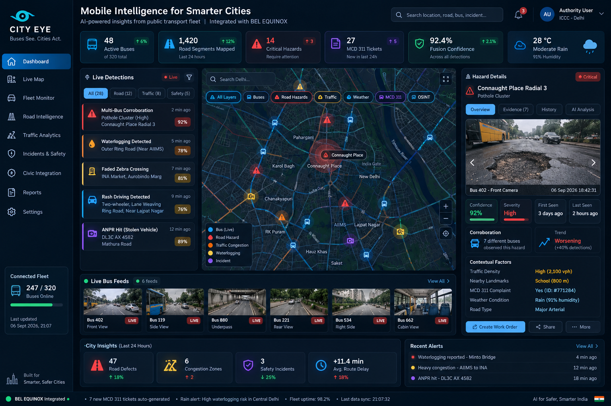

# 👁️ DRISHTI (CITY EYE) — Urban Intelligence & Data OS
> **Problem Statement 26124:** AI-Powered Mobile Urban Intelligence Platform Using Public Transport Fleet  
> **Organization:** Bharat Electronics Limited (BEL) • Smart India Hackathon (SIH)



---

## 📌 Executive Summary

**DRISHTI** is an Evidence-Fusion and Operational Intelligence platform that turns regular city bus fleets (e.g., Delhi Transport Corporation) into a persistent, opportunistic urban sensing network. 

Rather than wasting public funds streaming raw 4K CCTV video over 4G/5G, DRISHTI runs **YOLOv8 inference at the edge (on-bus)**, transmitting only lightweight **~280-byte JSON telemetry**. 

Crucially, DRISHTI does not just blindly trust AI detections. It solves the **Correlated False Positive Problem**: it dynamically discounts multi-camera errors during bad weather (rain/fog) and cross-corroborates visual detections with **transit delays** and **MCD 311 citizen grievances** before dispatching automated work orders into the **BEL Equinox ICCC**.

---

## 🚀 What Makes DRISHTI Novel? (Why We Win)

Existing Smart City platforms and AI startups suffer from a fatal flaw: **They treat every edge AI detection as unquestionable truth, leading to massive false alarm rates.** DRISHTI introduces three fundamental innovations:

### 1. The Environmental Correlation Discount ($N_{eff}$)
In a traditional system, if 10 buses drive past the same puddle while it's raining, the AI detects 10 potholes. The system combines these and says: *"10 independent buses saw this, I am 99.9% confident it is a pothole."* It dispatches an emergency crew to fix a puddle. 

**Our Novelty**: We built a mathematical bridge between OSINT (Weather) and Edge AI. The DRISHTI `fusion_engine.py` checks the Open-Meteo API in real-time. If it sees it is raining, it mathematically asserts that those 10 camera failures are *correlated*. It discounts the evidence ($N_{eff}$ formula), dropping the false confidence and saving the city from a wasted dispatch. Nobody else is dynamically adjusting edge-AI confidence based on live synoptic weather.

### 2. The "5-Second Moment" Priority Flip
Existing products rank potholes by **physical size**. 

**Our Novelty**: We rank by **operational consequence**. We fuse the edge detection with Transit Data (GTFS) and Citizen Reports (MCD 311). If a 4-inch pothole is causing an 11.4-minute delay on a critical school corridor, DRISHTI ranks it higher than a massive 10-inch pothole on an empty suburban highway. We tell the city *where* to deploy resources to save the most time, not just where the biggest hole is.

### 3. Pure "Build on Top" Architecture
We don't force the city to buy a new proprietary dashboard. We recognized that **BEL Equinox** *is* the city's existing dashboard. DRISHTI acts purely as a "Mobile Intelligence Layer." We format our fused intelligence as ETSI NGSI-LD standard JSON and inject it seamlessly into the systems the city *already* uses.

---

## 🏛️ 4-Tier System Architecture

```text
┌────────────────────────────────────────────────────────────────────────┐
│                        DRISHTI 4-TIER ARCHITECTURE                     │
└────────────────────────────────────────────────────────────────────────┘

 [ TIER 1: ON-BUS EDGE AI ]
  • Dashcams (Front Road, Side Curb, Rear ANPR, Undercarriage)
  • Hardware: Hailo-8 (26 TOPS) / NVIDIA Jetson Orin Nano
  • ML: INT8-Quantized YOLOv8 (Pothole, Waterlogging, Signage)
  • Output: 280-Byte JSON Telemetry (99.8% Bandwidth Reduction vs Video)
                │
                ▼ (REST / MQTT)
 [ TIER 2: DRISHTI MULTI-MODAL FUSION ENGINE ]
  • Mathematical Correlated Evidence Discount: N_eff = N / [1 + (N - 1) * ρ]
  • Multi-Domain Context Matrix (Traffic Density + Pedestrian Risk)
  • Live OSINT Integration (Open-Meteo Weather + MCD 311 Grievance Portal)
  • Output: Verified, Priority-Ranked Fused Intelligence
                │
                ▼ (ETSI NGSI-LD JSON)
 [ TIER 3: BEL EQUINOX ICCC DISPATCH ]
  • NGSI-LD Context Broker Entity Creation
  • Automated PWD Work Order Generation (Bitumen calculation & crew routing)
                │
                ▼
 [ TIER 4: CITY EYE COMMAND DASHBOARD ]
  • Glassmorphic Dark-Mode UI (Leaflet.js)
  • Live Fleet Tracking & Corroboration Heatmaps
```

---

## ⚡ The Mathematics of Evidence Fusion

When 7 buses pass a flooded pothole during monsoon rain, a naive AI multiplies probabilities and reports 99.9% certainty. In reality, all 7 cameras were impaired by the exact same wet lens and water glare.

DRISHTI models this environmental correlation dynamically:

$$N_{\text{eff}} = \frac{N}{1 + (N - 1) \cdot \rho}$$

* **$N$**: Raw number of vehicle passes (e.g., 7 buses).
* **$\rho$**: Weather correlation coefficient (Dynamically snaps from $\rho = 0.35$ to $\rho = 0.72$ when Open-Meteo detects relative humidity > 80% or precipitation).
* **$N_{\text{eff}}$**: Effective independent observations (**4.2** instead of 7.0), successfully preventing false alarms and budget wastage.

In our Monte-Carlo benchmark suite (`fusion_benchmark.py`), this mathematical approach achieved **0.0% False Escalation Rate** among the top 20 municipal emergencies.

---

## 🛠️ Quick Start Guide

### Prerequisites
* Python 3.8+ (**Zero external dependencies** needed for standard run)
* Modern web browser (Chrome, Edge, Firefox)

### 1. Start the Backend API & Fusion Engine (Port 8080)
```bash
python drishti_api.py
```
*Health Check:* Open `http://localhost:8080/api/health`

### 2. Start the Frontend Dashboard (Port 8000)
```bash
cd prototype-simple
python -m http.server 8000
```
*Access UI:* Open `http://localhost:8000`

---

## 🧪 REST API Endpoints

* `GET /api/health` — System status, uptime, and connected broker status.
* `GET /api/fusion/status` — Live status of the OSINT weather fetcher and current $\rho$ discount factor.
* `GET /api/detections` — List of all ingested edge hazard detections with fusion intelligence metadata.
* `POST /api/edge/telemetry` — Ingest 280-byte JSON telemetry from on-bus edge AI and route through the Fusion Engine.
* `GET /api/equinox/workorders` — Retrieve all active dispatched civic work orders.
* `POST /api/equinox/dispatch` — Generate and dispatch an ETSI NGSI-LD compliant PWD work order to BEL Equinox.

---

## 👨‍💻 Project Team
* **Team**: DRISHTI
* **Target Integration**: BEL Equinox ICCC
* **Hackathon**: Smart India Hackathon (SIH) 2026 - Problem Statement 26124
